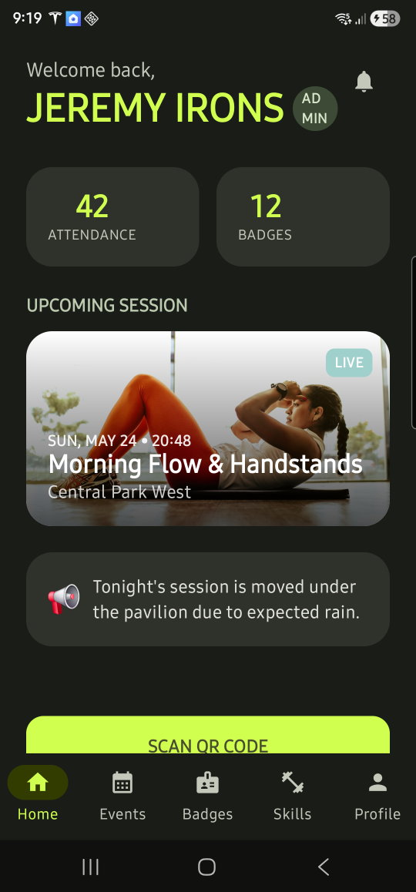
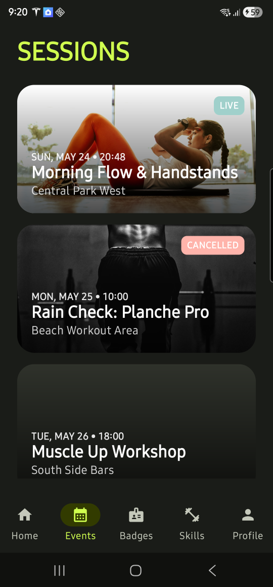
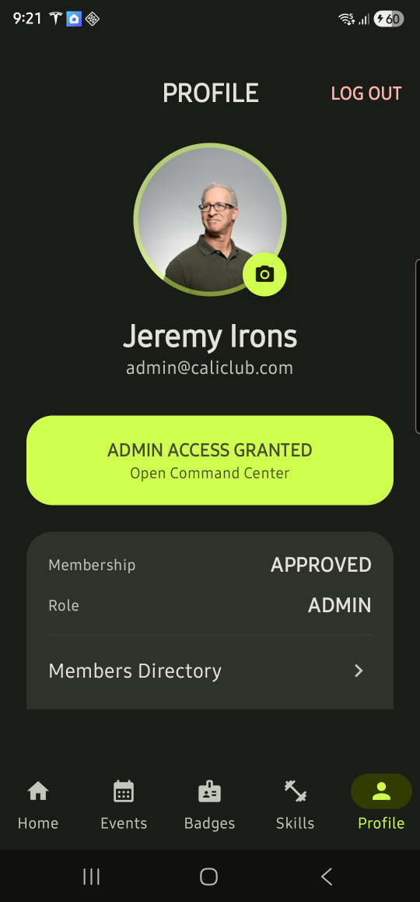
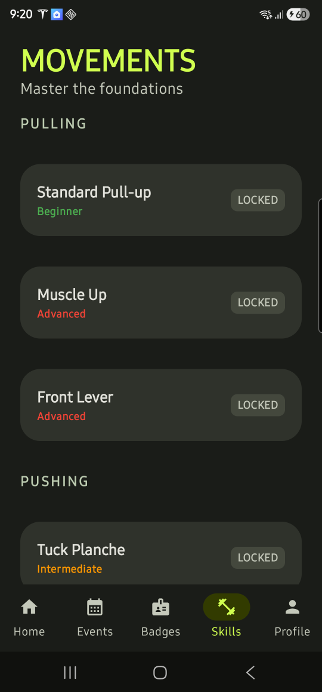
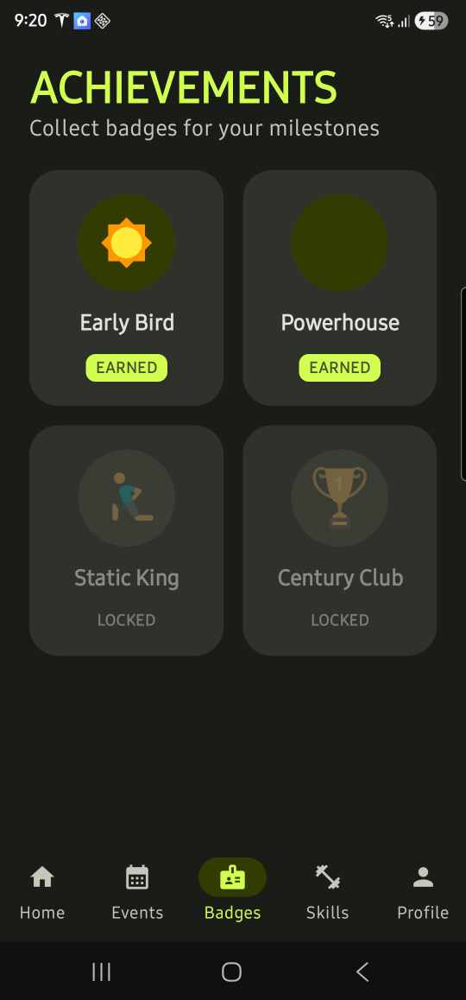

# Calisthenics Club App

A modern, modular Android application built with Jetpack Compose and Firebase. This app was originally created for the **University of Auckland Calisthenics Society** to manage events, track member attendance, and foster club identity through skills and achievements.

**Author:** Lance Yuriel Villanueva

## 📱 Screenshots

   &nbsp;&nbsp;&nbsp;&nbsp;
   &nbsp;&nbsp;&nbsp;&nbsp;
   &nbsp;&nbsp;&nbsp;&nbsp;
   &nbsp;&nbsp;&nbsp;&nbsp;
  

## ✨ Features

- **🔐 Robust Auth & Gating**: Email/Password and Guest login. Includes a member approval workflow (Pending/Approved/Rejected states).
- **🏠 Member Dashboard**: Quick view of user stats (attendance, badges), latest club announcements, and the featured upcoming session.
- **📅 Event Management**: Full RSVP system with automatic **Waitlist** and FIFO promotion. Includes real-time check-in via QR code scanning.
- **💪 Movement Library**: A categorized catalog of calisthenics skills with difficulty tagging to help athletes track their progression.
- **🏅 Achievement Gallery**: Unlockable badges for milestones and consistency, awarded by club admins.
- **🛠️ Admin Command Center**: Comprehensive tools for managing members, sessions, skills, badges, and broadcasting push notifications.
- **📸 High-Quality Media**: Optimized image handling with automatic minimization and custom cropping for profile and event photos.

## 🏗️ Architecture

The project follows **Clean Architecture** principles and is highly modularized for scalability and testability:

- **`:app`**: The entry point, handling navigation and dependency injection assembly.
- **`:feature:*`**: Feature-based modules (Home, Auth, Events, Skills, etc.) containing UI and ViewModels.
- **`:core:domain`**: Pure Kotlin module containing Business Logic, Models, and Repository interfaces.
- **`:core:data`**: Implementation of repositories, handling Firebase (Prod) and Local Mocking (Mock).
- **`:core:ui`**: Shared UI components, theme, and utility functions.

## 🛠️ Tech Stack

- **UI**: [Jetpack Compose](https://developer.android.com/jetpack/compose) (100% Kotlin)
- **Dependency Injection**: [Hilt](https://dagger.dev/hilt/)
- **Asynchronous Flow**: [Kotlin Coroutines & Flow](https://kotlinlang.org/docs/coroutines-overview.html)
- **Navigation**: [Compose Navigation](https://developer.android.com/jetpack/compose/navigation)
- **Backend**: [Firebase](https://firebase.google.com/) (Auth, Firestore, Storage)
- **Image Loading**: [Coil](https://coil-kt.github.io/coil/)
- **QR Engine**: [MLKit](https://developers.google.com/ml-kit) (Scanning) & [ZXing](https://github.com/zxing/zxing) (Generation)
- **Permissions**: [Accompanist Permissions](https://google.github.io/accompanist/permissions/)

## 🚀 Getting Started

### Prerequisites

- Android Studio Ladybug or newer
- JDK 17+
- A Firebase Project (for the `prod` build)

### Build Variants

The app uses **Product Flavors** to isolate environments and ensure no mock code leaks into production:

1.  **`prodDebug` / `prodRelease`**: Connects to your real Firebase backend. Requires a valid `google-services.json`.
2.  **`mockDebug`**: Runs **100% offline** with high-quality mock data. Perfect for testing UI, taking screenshots, or app store submissions without setting up a backend.

### Setup

1.  Clone the repository.
2.  To run the **Mock** version immediately:
    - Open the **Build Variants** tab in Android Studio.
    - Select **`mockDebug`** for the `:app` module.
    - Press **Run**.
3.  To run the **Production** version:
    - Add your `google-services.json` to the `app/` directory.
    - Register both `com.club.calisthenics` in your Firebase Console.
    - Select **`prodDebug`** and press **Run**.

## 📄 License

This project is licensed under the Apache License 2.0 - see the [LICENSE](LICENSE) file for details.
