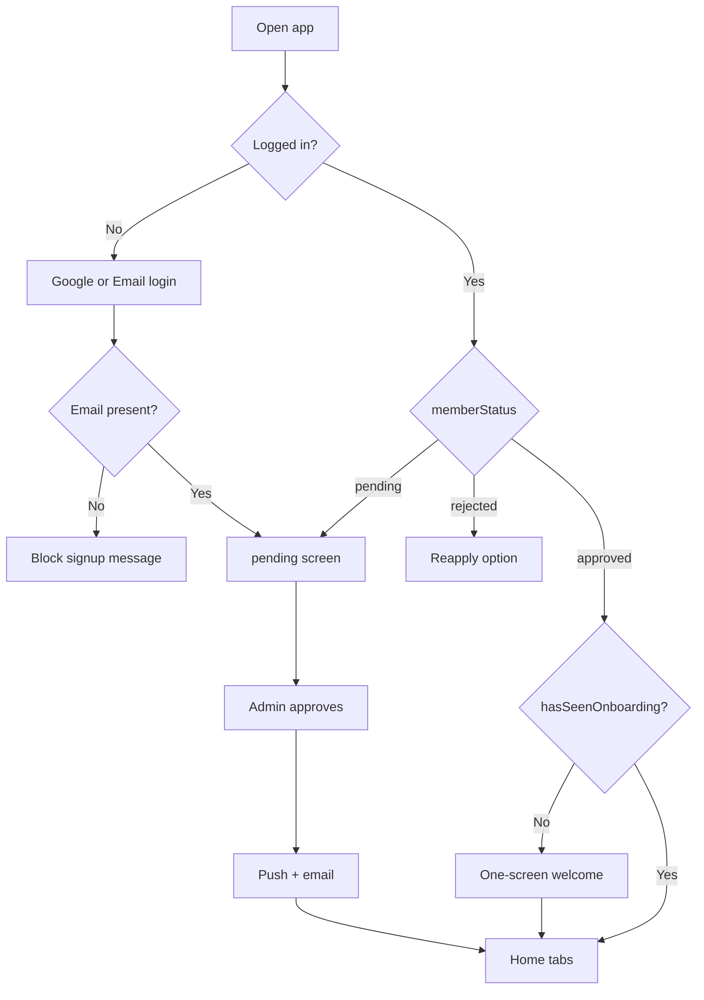
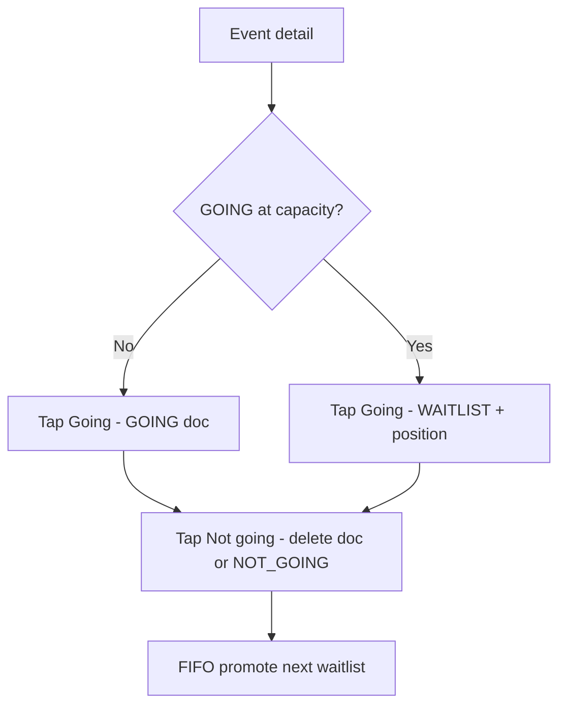
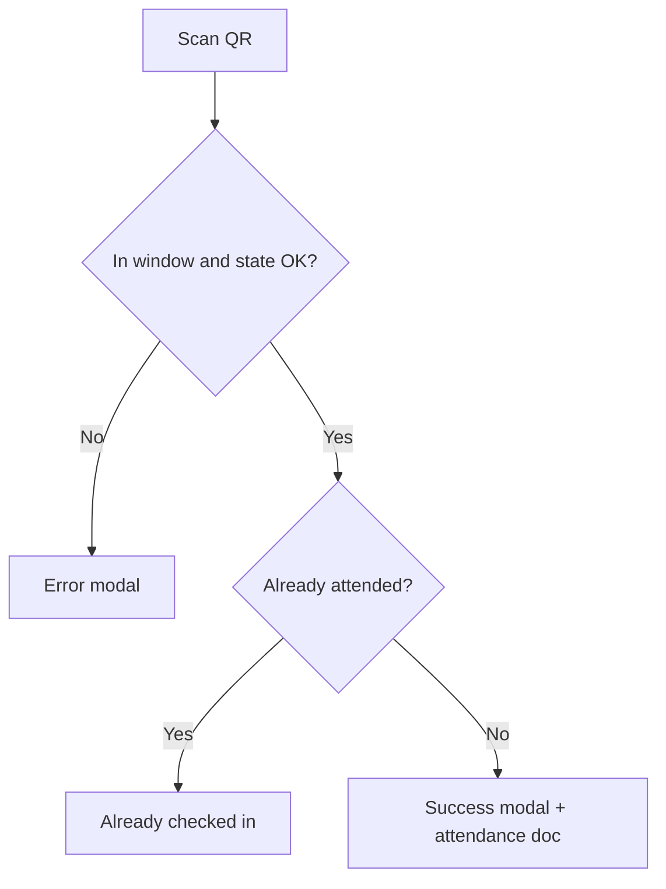
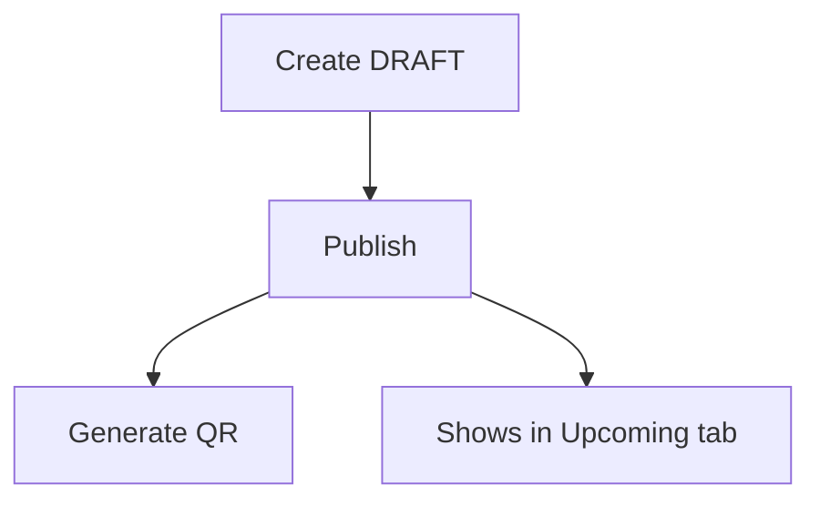

# User Flows

## Auth & membership

```mermaid
flowchart TD
  open[Open app] --> auth{Logged in?}
  auth -->|No| login[Google or Email login]
  login --> emailCheck{Email present?}
  emailCheck -->|No| block[Block signup message]
  emailCheck -->|Yes| pending[pending screen]
  auth -->|Yes| status{memberStatus}
  status -->|pending| pending
  status -->|rejected| rejected[Reapply option]
  status -->|approved| onboard{hasSeenOnboarding?}
  onboard -->|No| welcome[One-screen welcome]
  onboard -->|Yes| home[Home tabs]
  welcome --> home
  pending --> approve[Admin approves]
  approve --> pushEmail[Push + email]
  pushEmail --> home
```

## RSVP

```mermaid
flowchart TD
  detail[Event detail] --> full{GOING at capacity?}
  full -->|No| going[Tap Going - GOING doc]
  full -->|Yes| wait[Tap Going - WAITLIST + position]
  going --> notGoing[Tap Not going - delete doc or NOT_GOING]
  wait --> notGoing
  notGoing --> promote[FIFO promote next waitlist]
```

## Check-in

```mermaid
flowchart TD
  scan[Scan QR] --> valid{In window and state OK?}
  valid -->|No| errDialog[Error modal]
  valid -->|Yes| dup{Already attended?}
  dup -->|Yes| alreadyDialog[Already checked in]
  dup -->|No| success[Success modal + attendance doc]
```

## Admin publish event

```mermaid
flowchart TD
  draft[Create DRAFT] --> publish[Publish]
  publish --> qrGen[Generate QR]
  publish --> upcoming[Shows in Upcoming tab]
```
